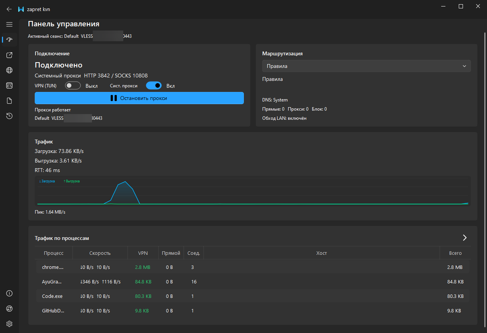
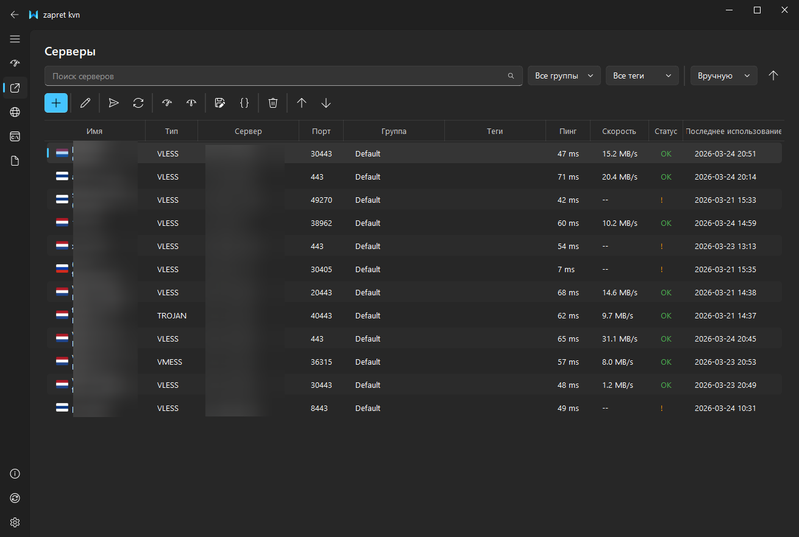
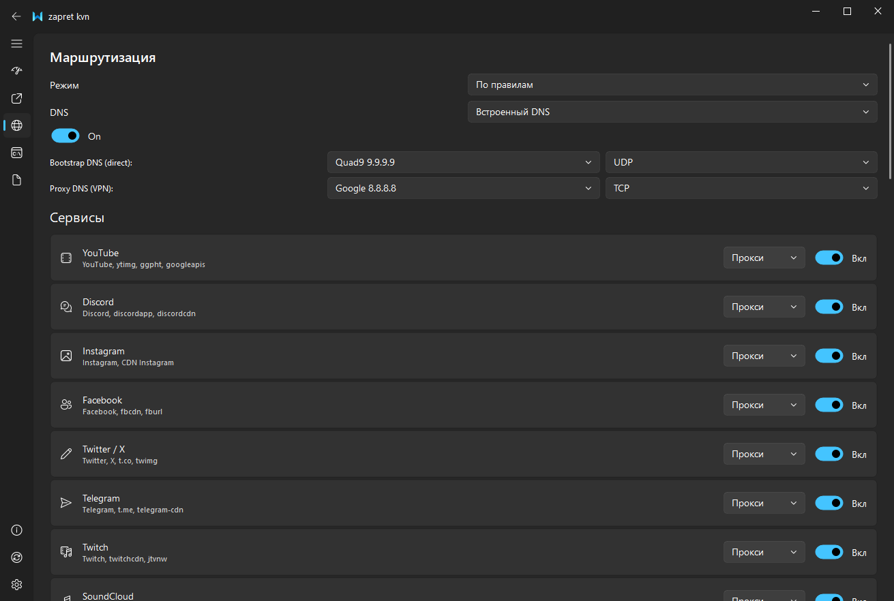

# Zapret KVN (beta)

Простой VPN-клиент для Windows с обходом блокировок от создателей [Zapret 2 GUI](https://git.zapret.moe/zapretdiscordyoutube/zapret). Работает из коробки.

### [Получить ключи можно тут](https://t.me/zapretvpns_bot) | [Скачать](https://git.zapret.moe/zapretdiscordyoutube/zapret-kvn/releases) | [Android](https://git.zapret.moe/zapretdiscordyoutube/ZapretKVN-android)




> [!WARNING]
> Первая бета-версия. Некоторый функционал может работать некорректно.
> 
> Сообщить о проблеме рекомендуем ТОЛЬКО сюда: [Issues](https://git.zapret.moe/zapretdiscordyoutube/zapret-kvn/issues)


## Что это

Zapret KVN объединяет несколько проверенных инструментов (xray-core, sing-box extended, Zapret) в одну программу с удобным интерфейсом. Под капотом — оркестрация ядер для максимальной скорости и совместимости с любым транспортом.

Программа рассчитана на то, чтобы работать из коробки — без ручной настройки конфигов и командной строки.

## Возможности

### Подписки

Страница **Подписки** управляет несколькими HTTP/HTTPS-источниками отдельно от
разового импорта на странице серверов. Поддерживаются обычные и Base64-списки
ссылок, а также независимые proxy `outbounds`/`endpoints` из Xray и sing-box JSON.
Подписка не импортирует DNS, routing, inbounds или системные настройки: активный
нативный JSON Zapret KVN остаётся их единственным источником.

Для источника доступны ручное и автоматическое обновление, include/exclude regex,
собственный User-Agent, лимит и срок действия, HTTP-кэш и QR-импорт из файла,
буфера или области экрана. Обновление атомарно: ошибка или пустой снимок сохраняет
последний успешный набор серверов. URL и серверные учётные данные хранятся в том же
`state.enc`, что и остальное состояние; в интерфейсе и диагностике URL маскируются.

Для совместимых провайдеров можно выбрать профиль Zapret KVN, Happ, INCY или
v2RayTun. Открытые `happ://add`, `incy://add`/`incy://import` и
`v2raytun://import` ссылки преобразуются в исходный HTTP/HTTPS URL. При
необходимости клиент передаёт стандартные `X-HWID` и `X-Device-*` заголовки:
по умолчанию используется один постоянный ID установки, либо владелец подписки
может указать свой ранее зарегистрированный ID. Случайная ротация HWID и
расшифровка закрытых `happ://crypt*` форматов не выполняются.

### Подключение по ключу

Вставьте ключ (ссылку) через **Ctrl+V** на странице серверов — программа сама определит тип и настроит подключение.

Поддерживаются ключи xray-core и sing-box extended:
- VLESS (+ Reality, XTLS-Vision, xhttp, WebSocket, gRPC, HTTP/2)
- Trojan
- Shadowsocks
- VMess
- Hysteria (`hysteria://`)
- Hysteria2 (`hy2://` и `hysteria2://`)
- TUIC (`tuic://`)
- **WireGuard** — вставьте содержимое `.conf`-файла целиком
- **AmneziaWG (AWG 1.5 / 2.0)** — `.conf` с параметрами обфускации (Jc/Jmin/Jmax, S1–S4, H1–H4, I1–I5, J1–J3, Itime)
- Сырые sing-box JSON-фрагменты (`{"type": ...}`, `{"outbounds": [...]}`, `{"endpoints": [...]}`) — так подключается любой протокол sing-box extended (snell, naive, trusttunnel и др.)

### WireGuard / AmneziaWG

Конфиг `.conf` (секции `[Interface]`/`[Peer]`) вставляется тем же **Ctrl+V** — текстом целиком.
Поддерживаются несколько пиров, `PresharedKey`, `PersistentKeepalive`, IPv6-endpoint'ы;
имя сервера берётся из первой строки-комментария `# ...`, если она есть.

Для обычного WireGuard клиент уважает порядок строки `DNS =`: первым резолвером
`proxy-dns` становится первый указанный адрес. Если `DNS =` отсутствует, остаётся
DNS из шаблона sing-box — адрес шлюза из IP интерфейса клиент не выдумывает.

Для AmneziaWG действует отдельная политика: явно заданный приватный DNS имеет
приоритет, а при публичном или отсутствующем DNS клиент может использовать шлюз
туннеля. Это нужно для Amnezia-серверов, которые перехватывают порт 53 и отвечают
со своего адреса внутри туннеля.

Такие серверы работают в режимах sing-box (прокси и TUN). TCP-пинг и тест скорости
для них не выполняются (протокол UDP-only) — сервер не помечается недоступным.

Обычный прокси-режим по умолчанию работает через sing-box extended, поэтому
Hysteria, Hysteria2, TUIC и native sing-box outbound JSON запускаются без
переключения в TUN. Xray можно выбрать вручную как резервный proxy engine; для
Xray-only transport'ов приложение автоматически использует Xray sidecar, не
отказываясь от основного sing-box runtime.

Все ссылки `hy2://` и `hysteria2://` обслуживаются встроенным официальным
клиентом Hysteria. Он поднимает защищённый локальный SOCKS только для транспорта,
а sing-box сохраняет полный контроль над DNS, raw JSON-маршрутизацией и TUN.
Исходная ссылка сохраняется буквально, поэтому `pinSHA256`, ECH, port hopping,
Gecko и неизвестные параметры URI не удаляются приложением. Для исторических
aliases (`peer`, варианты insecure/obfs password и query-based port hopping)
создаётся только временный совместимый конфиг официального клиента; сохранённая
ссылка и её fingerprint не меняются. При документированной несовместимости
Chrome QUIC fingerprint с сертификатом выполняется одна безопасная повторная
попытка без parroting. Старые ссылки `hysteria://` (Hysteria v1) и native
outbound JSON остаются в нативном пути sing-box.

### Режим TUN (VPN)

Перехватывает весь трафик на уровне системы. Автоматически направляет компоненты Windows (обновления, Defender, OneDrive) напрямую, а браузеры и мессенджеры — через VPN.

Доступен быстрый выбор приложений: Telegram, Discord, Chrome, Firefox, Spotify, торренты. Можно добавить свои игры и программы.

> Режим TUN требует запуска от имени Администратора.

### Системный прокси

Максимально быстрый режим без VPN — меньше прослоек, выше скорость туннеля.
Основное ядро здесь — sing-box extended. Подходит, если нужно пропускать через
прокси только браузеры или приложения с ручной SOCKS/HTTP-настройкой.

Порты по умолчанию: **Mixed (SOCKS5 + HTTP) — 1390**, **HTTP — 1391**. Это
сохраняет совместимость с приложениями, которые раньше использовали HTTP на
старом SOCKS-порту Xray. Фактически выбранная пара отображается на панели после
подключения. Входы слушают
`0.0.0.0`, чтобы локальный прокси при необходимости можно было раздавать другим
устройствам; если порты заняты, приложение автоматически подбирает соседнюю
свободную пару.

### Встроенный Zapret

Обход замедлений без VPN с помощью DPI bypass. Несколько встроенных пресетов на выбор. Можно использовать вместо Zapret GUI.

> Не все пресеты пока корректно обходят замедление VLESS. Работаем над этим.

### Мониторинг

- Скорость загрузки и отдачи в реальном времени
- Пинг сервера
- Трафик по процессам (какое приложение сколько потребляет)
- Тест скорости серверов

### Другое

- Автопереключение на другой сервер при падении скорости
- Авто-обновление программы и ядра xray
- Светлая, тёмная и системная темы
- Шифрование данных паролем
- Работа из системного трея

## Установка

1. Скачайте установщик со страницы [Releases](https://git.zapret.moe/zapretdiscordyoutube/zapret-kvn/releases)
2. Запустите скачанный `.exe` — он распакует программу в выбранную папку
3. Запустите `ZapretKVN.exe` из этой папки

Для режима TUN (VPN) запускайте от имени Администратора (правой кнопкой → "Запуск от имени администратора").

## Системные требования

- Windows 10 / 11 (x64)
- Для режима TUN: права Администратора

## Сборка Windows x64

Ядра закреплены вместе с SHA-256 в
`scripts/core-lock.windows-x64.json`. Локальный core bundle собирается один раз,
после чего повторные запуски используют download-cache:

```powershell
./scripts/build_core_bundle.ps1
./scripts/install_core_bundle.ps1
python build.py
```

Локальный Windows-сборщик кэширует готовый `core-windows-x64.7z` по хэшу lock-файла,
кэширует Windows virtualenv и PyInstaller binary cache, запускает тесты, а
приложение собирает только через проектный `build.py`. В artifacts публикуются
и portable-приложение, и отдельный Windows x64 core bundle.

## Быстрый старт

1. Получите ключ (ссылку) вида `vless://...` или WireGuard/AWG `.conf` от вашего провайдера VPN
2. Откройте программу → перейдите на страницу **Серверы**
3. Нажмите **Ctrl+V** — сервер добавится автоматически
4. Нажмите кнопку подключения на панели управления

## Где взять ключ

Если у вас нет VPN-ключа, получите его в боте: [@zapretvpns_bot](https://t.me/zapretvpns_bot)

## Обратная связь

- [Telegram-канал](https://t.me/vpndiscordyooutube) — новости и обновления
- [Сообщить о проблеме](https://git.zapret.moe/zapretdiscordyoutube/zapret-kvn/issues)

## Лицензия

MIT
